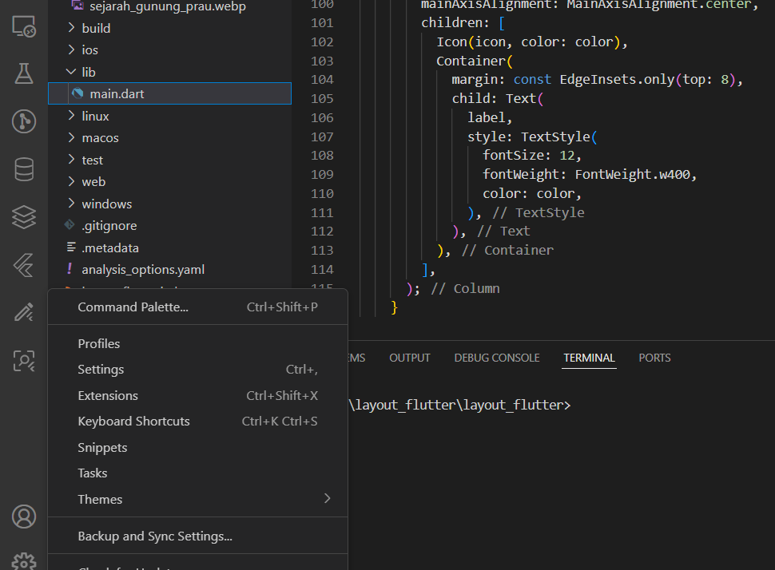
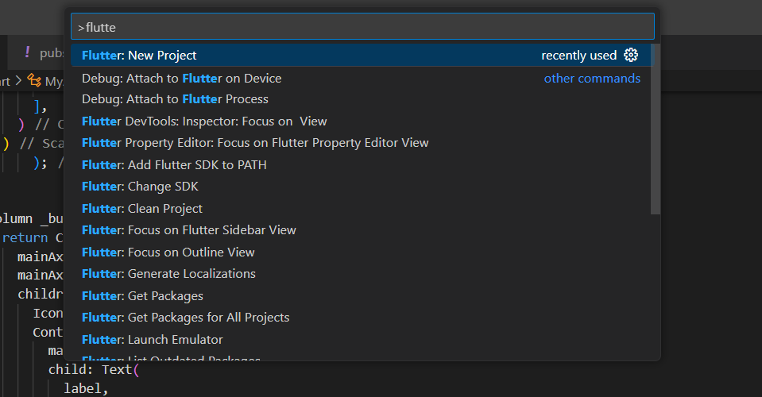
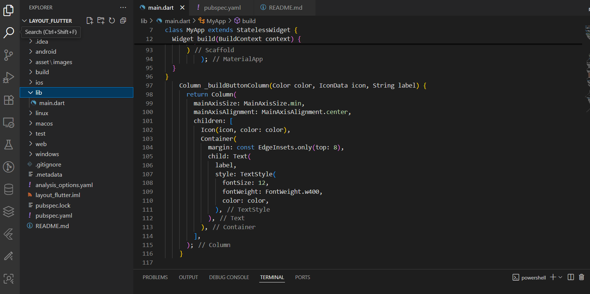
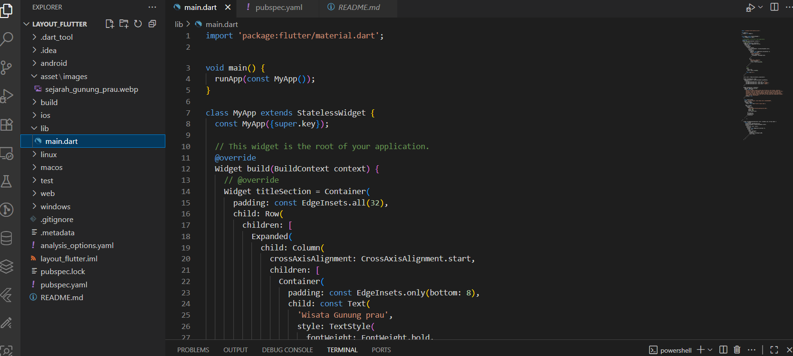
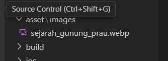
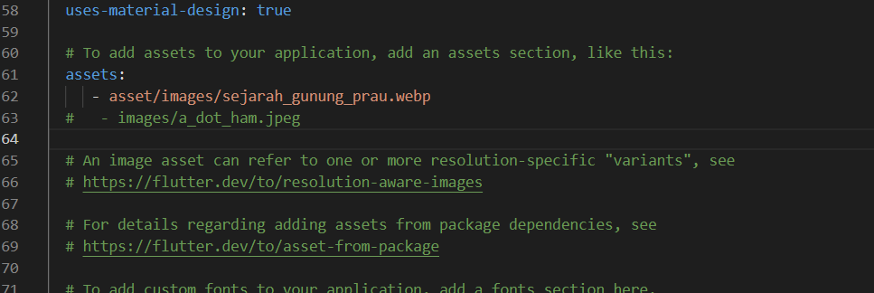
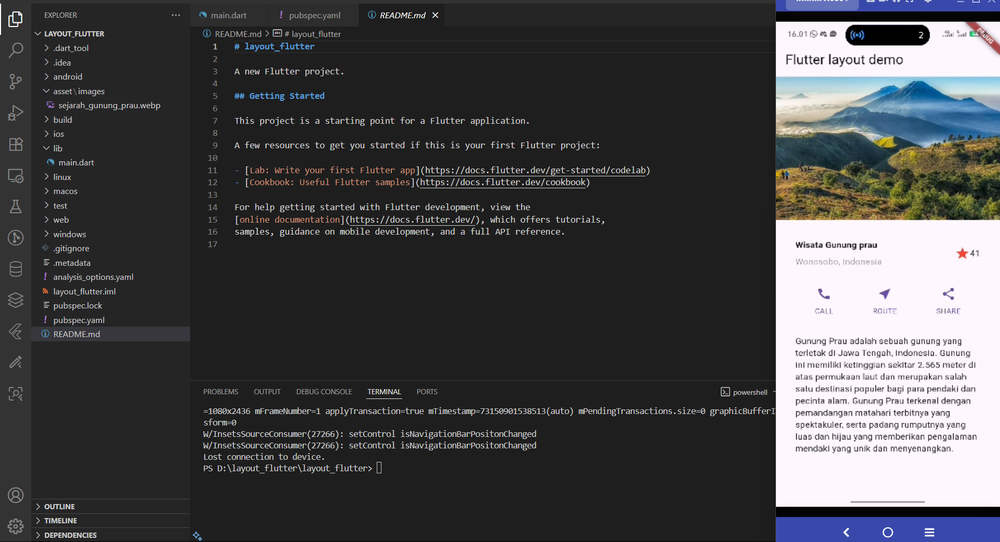

# layout_flutter

A new Flutter project.

## Getting Started

## Screenshot

    pertama membuka command palette, atau bisa dengan tekan ctrl + shift + p

    terus kemudian ketik flutter, dan tekan flutter: new project

    pilih folder yang telah dibuat, dan kemudian tekan select

    kemudian tekan lib dan masuk ke main, agar bisa mengganti dan menambah code program, seperti memasukkan nama dan nim kemudian nama wisata, gambar, dan tentang wisata tersebut

     kemudian membuat asset/images dan kemudian memasukkan gambar wisata tersebut 

     lalu masuk kedalam pubspec.yaml dan ketik 
     assets:
     - asset/images/sejarah_gunung_prau.webp
  #   - images/a_dot_ham.jpeg

     dan ini hasil dari tampilannya.

This project is a starting point for a Flutter application.

A few resources to get you started if this is your first Flutter project:

- [Lab: Write your first Flutter app](https://docs.flutter.dev/get-started/codelab)
- [Cookbook: Useful Flutter samples](https://docs.flutter.dev/cookbook)

For help getting started with Flutter development, view the
[online documentation](https://docs.flutter.dev/), which offers tutorials,
samples, guidance on mobile development, and a full API reference.
